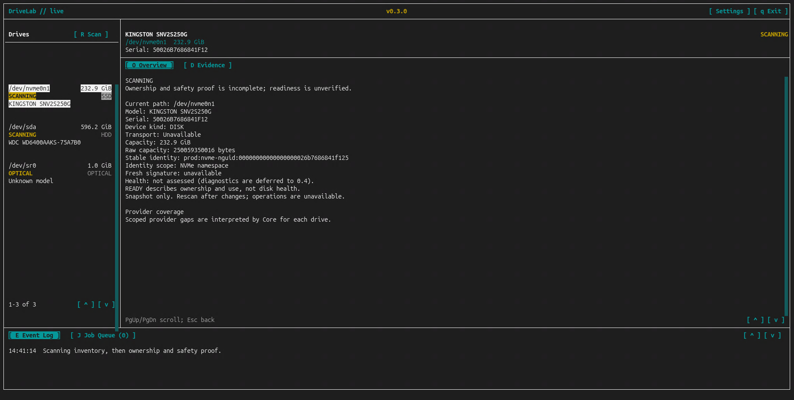

# DriveLab 0.3.0 — Discovery and Safety

0.3.0 introduces real Linux storage awareness. Running DriveLab normally now
opens the production ncurses interface with physical devices from the host,
their identity, current usage and the evidence behind their safety status.


## What 0.3.0 Adds

- Native Linux physical-device discovery, with model, serial, capacity,
  transport and identifiers where available.
- Stable physical identity, so a changing or reused `/dev` path is not treated
  as proof that a drive is the same device.
- Direct host-usage checks for mounts, swap and system storage.
- An ownership graph that follows storage relationships and collects evidence
  from device mappings, LVM, RAID, ZFS, processes and supported Proxmox
  configurations.
- A real production TUI with Overview and Evidence views, rescanning and
  selection revalidation.
- Separate device kinds for disks, optical devices, floppies and unresolved
  physical devices. An optical drive is not treated as an unknown HDD or SSD.

Unavailable information stays visible as a gap. Support for an ownership source
does not mean every configuration can be fully resolved.

## Reading the Status

| Status | Meaning |
| --- | --- |
| **READY** | Sufficient current evidence that the disk is free of ownership or use. |
| **BUSY** | Positive evidence of current ownership or use. |
| **CAUTION** | DriveLab could not fully establish that the disk is free of use. |
| **RESTRICTED** | Host-critical or system storage, such as the backing device for root or boot. |

READY is an ownership/use result, **not a health rating**. Health diagnostics
begin in 0.4.x.

Discovery happens in stages. Physical devices appear first; disks show
**SCANNING** while the ownership and safety checks continue. Pending evidence
never counts as READY.



Only DISK devices receive the disk safety assessment. OPTICAL, FLOPPY and
UNKNOWN_PHYSICAL devices remain visible with their kind and available identity
information, without a disk readiness claim.

Press **R** to acquire a fresh snapshot. Previous readiness is cleared while
the scan runs. A selected drive stays selected only when its identity and other
observations still match; a missing or replaced device clears the selection.

## Build and Run

The [manual](MANUAL-0.3.0.md) covers dependencies and controls. On native Linux,
from the repository root:

```bash
cd 0.3.0/source
cmake -S . -B build -DCMAKE_BUILD_TYPE=Debug
cmake --build build --parallel 4
ctest --test-dir build --output-on-failure
./build/src/drivelab
```

The native suite contains 22 tests. See the [verified environments](MANUAL-0.3.0.md#verified-environments)
for the Linux VM and bare-metal qualification coverage and the development host.

These modes are also available:

```bash
./build/src/drivelab --demo
./build/src/drivelab --dry-run
./build/src/drivelab --help
./build/src/drivelab --version
```

Demo uses canned drives and simulated workflows. Dry-run prints mock inventory
and capabilities with external execution disabled; it does not scan the host.

## Current Limits

Production mode is inspection-only. SMART/health, benchmarks, destructive
testing and sanitisation are not implemented. The demo's simulated diagnostic
and operation screens do not represent production capabilities.

Safety checks describe a snapshot, not continuous monitoring. Incomplete access
or unresolved ownership can leave a disk at CAUTION. Deeper proof can take time
on weaker systems, even though the device list appears early. Further scan
efficiency and refinement from production experience are planned.

The interface has been checked in a native Ubuntu terminal. Rendering and
geometry still vary across terminal and SSH clients, including some Windows
PowerShell and PuTTY sessions.

## Version Files

- [Manual](MANUAL-0.3.0.md)
- [Changelog](CHANGELOG-0.3.0.md)
- [Roadmap at 0.3.0](ROADMAP-0.3.0.md)
- [Source](source/)

License: pending.
