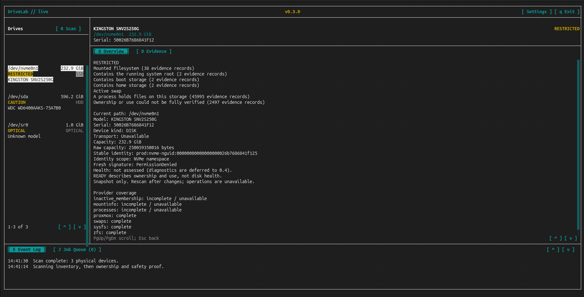

# DriveLab

DriveLab is a Linux-first terminal project for storage inspection and diagnostics.
The current version discovers real drives, resolves their identity and checks
whether they are in use. Health diagnostics and storage operations come later.



## Current Published Version

### DriveLab 0.3.0 — Discovery and Safety

0.3.0 brings real Linux storage awareness to the terminal interface. It discovers
physical devices, follows mounts and ownership relationships, and shows the
evidence behind each disk's safety classification.

The drive list appears while the deeper checks continue. Disks stay **SCANNING**
until those checks finish, then show **READY**, **BUSY**, **CAUTION** or
**RESTRICTED**. Optical devices are identified separately.

READY means there is sufficient current evidence that a disk is free of
ownership or use. It says nothing about disk health. Production mode is
read-only in 0.3.0; SMART, benchmarks and sanitisation are not implemented yet.

Read the [0.3.0 release page](0.3.0/) or [manual](0.3.0/MANUAL-0.3.0.md)
for status meanings, controls and current limits.

## Build and Run 0.3.0

DriveLab targets native Linux terminals. You need CMake/CTest, a C++20 compiler,
ncursesw, libudev, pkg-config and libblkid 2.38 or newer development files.
OpenZFS development libraries are optional for live ZFS ownership checks.
See the [manual's requirements](0.3.0/MANUAL-0.3.0.md#requirements).

From the repository root:

```bash
cd 0.3.0/source
cmake -S . -B build -DCMAKE_BUILD_TYPE=Debug
cmake --build build --parallel 4
ctest --test-dir build --output-on-failure

./build/src/drivelab
```

Use `./build/src/drivelab --demo` for the simulated interface, or
`./build/src/drivelab --dry-run` for the mock command-line view. Both work
without root and do not access real drives.

## Versioned Snapshots

Each published version keeps its own source and documentation:

- [0.3.0 — Discovery and Safety](0.3.0/)
- [0.2.0 — Core Architecture](0.2.0/)
- [0.1.0 — Interface Prototype](0.1.0/)

## Current Direction

Next is 0.4.x: SMART and health diagnostics, clearer health explanations and
self-tests. Scan efficiency, startup behaviour, terminal/SSH compatibility and
device-kind presentation will also get further attention.

## Documentation

- [0.3.0 manual](0.3.0/MANUAL-0.3.0.md)
- [0.3.0 changelog](0.3.0/CHANGELOG-0.3.0.md)
- [Roadmap at 0.3.0](0.3.0/ROADMAP-0.3.0.md)
- [Repository changelog](CHANGELOG.md)
- [Project roadmap](ROADMAP.md)
- [Contributing](CONTRIBUTING.md)

License: pending.
