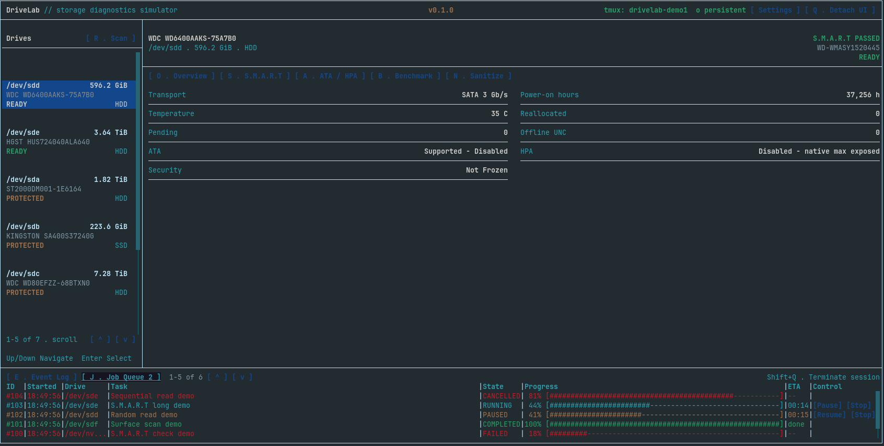

# DriveLab

DriveLab is a Linux-first terminal project for guided storage workflows. The
current published snapshot focuses on the interface and interaction model that
later versions will connect to production storage providers.



## Current Published Version

### DriveLab 0.1.0 — Interface Prototype

DriveLab 0.1.0 is a functional interface/workflow prototype, not yet a
functional storage utility.

It demonstrates the TUI, keyboard and mouse navigation, storage views,
protected-drive states, contextual information, Event Log, Job Queue, and
simulated workflows. The demo uses canned drives and does not access hardware
or execute storage commands.

It does not provide production hardware discovery, diagnostics, benchmarks,
sanitisation, persistent jobs, or safety enforcement. The exact historical
source includes early exploratory Linux integration code, but that code is not
presented as a supported production workflow in this release.

## Build and Run 0.1.0

DriveLab currently targets Linux terminals. On Debian, Ubuntu, or Proxmox:

```bash
sudo apt update
sudo apt install build-essential libncurses-dev

cd 0.1.0/source
g++ -std=c++17 -O0 -g -Wall -Wextra *.cpp -lncursesw -pthread -o drivelab
./drivelab --demo
```

Demo mode does not need root and does not touch real drives.

## Versioned Snapshots

Each published version keeps its own source and documentation:

- [0.1.0 — Interface Prototype](0.1.0/)

Future versions will use the same self-contained layout so older milestones
remain easy to browse.

## Current Direction

Development is moving from the interface prototype into the 0.2 Core
architecture. That work separates the TUI, device model, providers, jobs,
safety policy, process execution, configuration, logging, and reporting before
production hardware features are added.

## Documentation

- [0.1.0 manual](0.1.0/MANUAL.md)
- [Repository changelog](CHANGELOG.md)
- [Project roadmap](ROADMAP.md)
- [Contributing](CONTRIBUTING.md)

License: pending.
